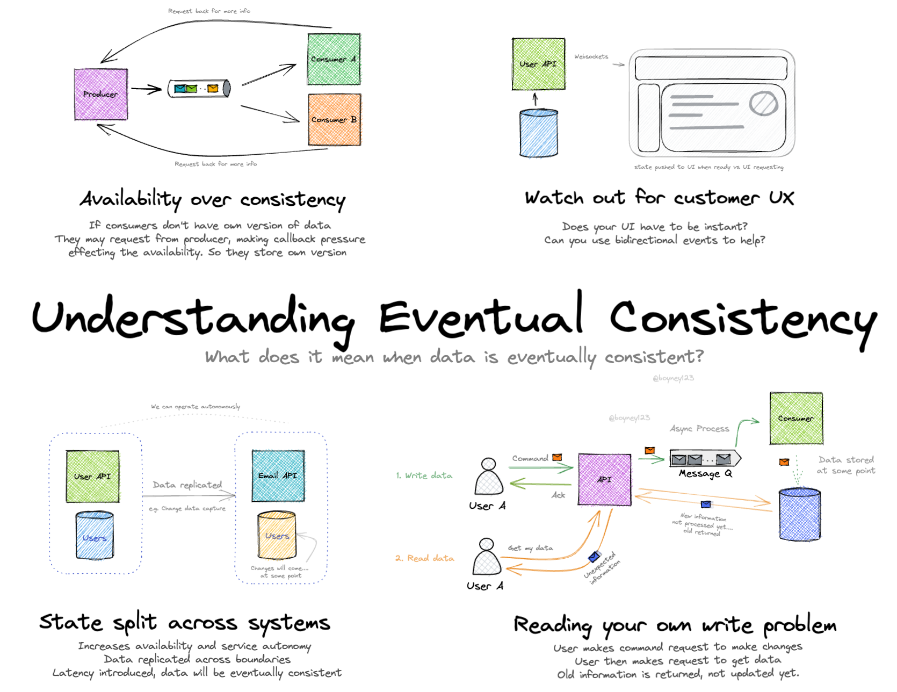
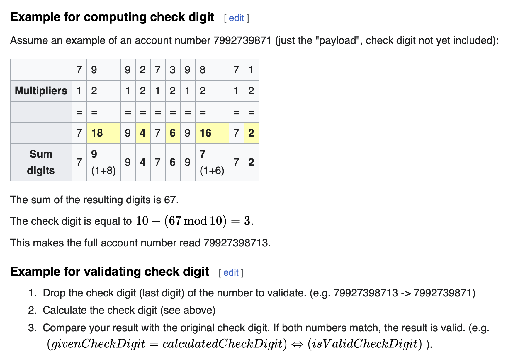
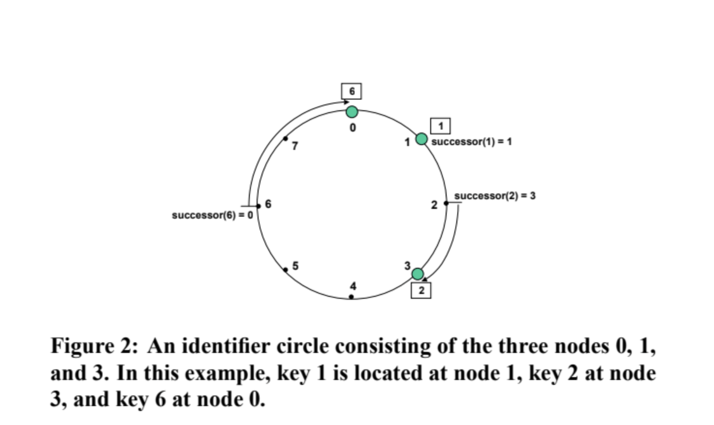
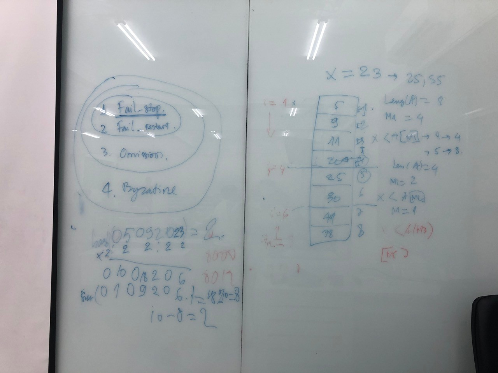

# Distributed Systems

This is the repo of Distributed Systems course

## Lecture 01
[How to Write Go Code](https://go.dev/doc/code#:~:text=Go%20programs%20are%20organized%20into,files%20within%20the%20same%20package.)

## Lab01

## Lecture 02

## Lab02
[rpc](https://pkg.go.dev/net/rpc)
[lab02 submit link](https://docs.google.com/forms/d/e/1FAIpQLSfCGAMuYYLqXx6jTMc3Fmx5dyTD5aJIQPshe8XjIMaf3YvZlw/viewform)
## Lecture 03

## Lab03

## Lecture 04

Các server phân biệt với nhau bằng IP (và port)

Trong key-value store, thêm phần replication vào. Mỗi lần user set giá trị vào bảng key-value khi put dữ liệu lên, ta cần copy dữ liệu qua các server còn lại (giả sử là 5 server)

Các test cases:
- TC_01: Put/get
- TC_02: Put/get when primary is dead
- TC_03: put and get in slow network 

hàm ping để kiểm tra primary server còn sống

tất cả các server tự gửi cho nhau bằng hàm check để lấy một cặp ip-version, chờ vài chục giây -> chọn version cao nhất và ip thấp nhất làm primary mới nếu primảy hiện tại chớt

các máy phải lưu primary_ip, có biến isPrimary


Deadline: 16h00 18/08/2023

Link: https://docs.google.com/forms/d/e/1FAIpQLSdc2hOqxAeM4oY5JvTxe8kG6YGj67zF27OcAZXZI236IFFkew/viewform

dành riêng một IP để client connect đến, nếu primary chớt thì thằng mới vẫn listen thằng IP đó, và một lúc chỉ có một ông listen để tránh conflict

consistency: tính nhất quán. Ví dụ: 
- set x=1 thì get x phải bằng 1 ==> read-your-write consistency 
- eventual consistency
- client set x=1 --get-x--> set x=3 --get-x  ==> sequentual consistency

xử lí tình huống mạng chậm -> set x=1 đến sau set x=3
- gửi thêm timeStamp 
- sử dụng NTP (một loại time server) để triển khai đồng hồ dùng chung
- [Lamport Clock](https://en.wikipedia.org/wiki/Lamport_timestamp)
- 
## 220823
## Fault Tolerance

Chọn ông leader

- nếu leader chớt (crash) thì dữ liệu của nó đi đâu về đâu? -> dữ liệu store trên ram sẽ mất hoàn toàn -> chọn new leader

- nếu đã chớt mà sống lại (restore) -> liên hệ new leader để copy dữ liệu sang -> không khả thi trong thực tế vì mấy ngàn server, dữ liệu rất lớn -> lưu dữ liệu về local định kỳ (snapshot) (không lưu ram như ở trên) -> thiếu nhiêu thì mới bắt đầu hỏi new leader để copy qua

các cách một dev lưu hashtable vào file/database:
- value<khoảng trắng>key
- cứ x-byte đọc thành 1 giá trị
- lưu dạng xml
- lưu dạng json

làm sao để biết file của leader vừa chớt và new leader khác nhau chỗ nào =))
- lưu hành động của client bằng một cái file (write_head_log file)

| thứ tự | operation | operation | process|
|--------|-----------|-----------|--------|
|   1    |    _      |  x=1      |  v     |
|   2    |    -      |  w=2      |  x     |

Các server đều có một file log, khi có vấn đề xảy ra, ta chỉ cần copy các dòng thiếu của các file log với nhau

Replicated State Machine: 
Ý tưởng là làm ra một hệ thống không bao giờ chớt -- trách nhiệm không bao giờ chớt (luôn có người chịu trách nhiệm)


Ref:
- https://github.com/eliben/raft
- https://eli.thegreenplace.net/2020/implementing-raft-part-0-introduction/
- https://raft.github.io/


Quy tắc vote:
- lượng phiếu bầu lớn hơn 50% thì thắng
- nếu số phiếu bằng nhau -> vote lại
- mỗi người dc vote một lần
- nếu một người vận động (A) một người khác (B) mà người đó (B) chưa vote cho ai thì phải vote cho người vận động (A)
- term và length(log) phải lớn hơn mỗi server khác đang xét

- election timer (các timer này tại khác server và set thời gian lặp khác nhau, vd: *0.001*(timer reset của leader--ping timer)-1-2-3-5-7-10)
    - nếu timer vừa hết mà chưa bầu ai, thì bầu cho mình và gửi request tới những người khác bầu cho mình
    - khi đã bầu thì reset timer để chạy lại từ đầu
    - leader có 2 timer, một election, một để reset timer các timer của các server khác

Một server có 3 trạng thái
- follower - khi vừa start, và có election timer 
- candidate - khi election timer vừa hết
- leader - khi nhận được nhiều hơn 50% phiếu bầu, bắt đầu start ping timer (timer này ngắn, vd: 15s)

Trường hợp leader không chớt mà chỉ disconnect, khi đó, nó không restart để trở thành follower lại mà vẫn giữ trạng thái leader 
- dùng cơ chế safety: lưu lại nhiệm kỳ (term)
mỗi election timer hết thì cập nhật term thêm 1 đơn vị,

tất cả request sẽ đi kèm với term, nếu term nhỏ hơn thì hoy nghỉ chơi :'> 

leader cũ khi gặp request ping timer có term lớn hơn bản thân -> trở thành follower, bỏ ping timer đang có

số server nên là 2f+1 để có số lượng vote có thể đạt được max là f+1, 

số server được phép down là f, khi số server down vượt qua số lượng này, hệ thống đứng im, không làm gì nữa cả, tránh trường hợp sai sót

ping timer phải đủ nhỏ để tránh các server khác bầu liên tục gây lãng phí (nên nhỏ hơn thằng nhỏ nhất???)

membership change using timer machinism, length(log) và term - RAFT


ta chỉ cần replicate lại f+1 cái trên tổng số 2f+1 server là đã có thể trả lời cho client là đã thành công

| primary                             |   leader  |
|-----------                          |-----------|
|người replicate dữ liệu dưới database| người phân quyền, không bao giờ chớt|


- cơ chế liveness

Cả hai phương pháp RAFT và PAXOS đều giải quyết bài toán 
|RAFT       | PAXOS     |
|---        |---        |
|chứng minh một phần trong bài báo, dễ hiểu =))|được toán học chứng mình và công nhận đồ, khó hiểu, khó implement, mặc dù đã được [google spanner](https://cloud.google.com/spanner/docs/replication), microsoft implement |
|dùng 2 timer: ping và election | dùng timer nhưng dùng kiểu khác |

### Giới thiệu Lab04
Chỉnh lại 2 con số timer (15s vs 300s chỉnh thành 2 số khác thử) để chạy lại mã nguồn và hiểu dc source

16h00, 23/08/2023
https://docs.google.com/forms/d/e/1FAIpQLSdlwRRDMkdRRVjl30ijyV1OpfzXjagWRmaFv3Jgi9IG_VTFLg/viewform

https://github.com/eliben/raft/tree/master/part1

Ý tưởng: ông leader luôn có log ukie nhất, có cơ chế gửi đến các follower nội dung client request 

mỗi log đi kèm term 

khi leader gửi log mới và record log ngay phía trước tới mỗi server, mỗi server sẽ thực hiện so sánh record ngay trước với record cuối của mình xem trùng không, nếu trùng thì ngon :v

trường hợp không trùng, follower response lại là not match, leader gửi lại 2 record trước và log mới, và server nhận được lại tiếp tục so sánh, hành động này được lặp lại cho đến khi gặp được dòng trùng và chèn hết cái nùi mới nhận mà trùng dô

leader không được phép thay đổi log của mình, follower thì được phép thay đổi.


## 290823

Thuật toán đồng thuận: có nhiều máy chủ, đề xuất nhiều thông tin và sau khi đã đồng ý với nhau thì ở đầu ra chỉ có một thông tin đồng nhất --> thuật toán này không có leader/ người quan sát như lab04 (raft) đã làm
- các yêu cầu consensus: (một số pp như RAFT, PAXOS)
    - termination: thuật toán phải kết thúc -- raft không đảm bảo điều kiện này khi các khoảng thời gian trùng nhau 
    - agreement: phải có một kết quả đồng thuận cuối cùng
    - validality: kết quả đầu ra phải nằm trong các đề xuất đã đưa ra ban đầu (tính hợp lệ)

File log: ghi 

Keyword: Replicated state machine -- consensus 

[FLP](https://ilyasergey.net/CS6213/week-03-bft.html#:~:text=The%20FLP%20theorem%20states%20that,one%20node%20may%20experience%20failure.): nói về một định lý rằng không có một thuật toán nào đảm bảo được cả ba yêu cầu consensus (termination, agreement, validality) với điều kiện có ít nhất 1 máy có thể chớt bất cứ lúc nào. Đã được chứng minh bằng toán học.

## Wrap-up Replication
về mặt lý thuyết thuật toán này có thể chạy mãi mãi

Leader election: 

Cấu trúc file log trong raft:
- mỗi dòng là 1 record gồm: 
    - số thứ tự (quan trọng nhất) (index - phải gửi request đi tới các máy chủ khác)
    - term 
    - command/operator 
    - parameter 
    - value


1 record khi lưu được trên f+1 trên tổng số 2f+1 máy chủ -> record's index đó sẽ được gọi là commited index -- khác index (chỉ nói đến thứ tự dòng record)

term: term của record đó -- khác với currentTerm: term hiện hành

các file log ở các máy chủ có thể rất khác nhau, nhưng phải có ít nhất f+1 máy chủ có commited index giống hệt nhau

leader gửi index và term previous record và nguyên record hiện tại

máy chủ có index nhỏ hơn commited index thì không được phép trở thành leader

replicated rule: 
- currentTerm == term thì replicate dễ -> ghi f+1 thì set commited index liền được
- trong trường hợp hai record khác term, nghĩa là có ít nhất 1 record có term khác currentTerm -> buộc phải wait để các record của term trước current term đã được replicate và commit

wrap-up:
- các file log không nhất thiết giống nhau 
- quy tắc back-up dữ liệu (thêm một cái phía trước) -> khi chưa trùng thì back thêm về đến khi trùng và chờ replicate từ chỗ trùng đến chỗ mới nhất, khi thành công hết rồi mới trả về thành công
- currentTerm khác term trong record đang cần commit thì phải wait cho có ít nhất một record phía trước (xem thêm trong paper)

Snapshot: luôn phải triển khai trong thực tế

thêm máy vào như nào :'> --> quorum và id thay đổi... (gọi là configure) -- bắt nguồn từ request của client -- không tắt máy và đổi file config nha ba =))

làm thế nào để các máy khác biết có máy mới? (ghi vào 1 entry gọi là special và replicate như 1 record) -> nếu nhận được thì đổi thuật toán cho phù hợp với các config mới :'> (ví dụ số máy để có thể xác nhận commited index)

## 050923

Một số lỗi thường gặp:
1. Fail-stop
2. Fail-restart
3. Omission
4. Byzatine fault
![Một số lỗi hệ thống thường gặp]](image-2.png)

CAP => Định lí cho rằng không thể xây dựng được hệ thống mà khi mạng đứt kết quả vẫn trả về đúng và kịp thời. Chỉ có thể chấp nhận một trong hai kêta quả sau. một là, hệ thống tạm ngừng hoạt động, hai là kết quả trả về trễ. 

[Eventual consistency](https://www.baeldung.com/cs/eventual-consistency-vs-strong-eventual-consistency-vs-strong-consistency)


The CAP theorem states that distributed databases can have at most two of the three properties: consistency, availability, and partition tolerance. As a result, database systems prioritize only two properties at a time. 

[the-cap-theorem-in-dbms](https://www.geeksforgeeks.org/the-cap-theorem-in-dbms/)


để các server không bị quá tải, ta làm như sau:
- dùng nhiều máy
- lưu xoay vòng giữa các máy
- request thứ R sẽ được lưu vào server thứ (R mod n)+1, trong đó n là tổng số server có
- lưu file config -> không dùng do bự và nguy hiểm khi file này gặp vấn đề
- giới thiệu [Luhn Hash Algo](https://en.wikipedia.org/wiki/Luhn_algorithm) (the first hash algo)


- nên lưu một server với vài ip, khi hash ta sẽ hash dc thành 5 số -> để tìm server lưu nhanh hơn và có thể chia đều dữ liệu cho các server??

- ý tưởng: 
key -> number A -> hash(number) -> number B -> chọn server lưu 

khi thêm một server vào, ta phải chuyển dữ liệu đi tè le 
**18 (hash_3) -> server 1 -> hash_5 -> server 4**

19 (hash_3) -> server 2 -> hash_5 -> server 5

20 (hash_3) -> server 3 -> hash_5 -> server 1

**21 (hash_3) -> server 1 -> hash_5 -> server 2**

-> consistent hashing ra đời nhằm giải quyết vấn đề này

Bước 1: hash ip tất cả server thành số

ví dụ
hash(server1) = 4

hash(server2) = 6

hash(server3) = 10

khi nhận được một cái key, ta hash key vừa nhận, và theo chiều kim đồng hồ, gặp thằng nào đầu tiên thì lưu dô thằng đó 

ví dụ: key = gaugaumeomeo -> hash(key) = 5 -> lưu vào server 2



[Sharding](https://www.geeksforgeeks.org/database-sharding-a-system-design-concept/)

Ref. https://www.inf.ed.ac.uk/teaching/courses/ds/handouts/handout12.pdf




## 120923
## Distributed transaction - Lab06

Tài liệu và thông tin cho bài lab 06 (Distributed Transactions):

1. Các bạn tham khảo các liên kết bên dưới để chuẩn bị cho bài lab.

https://drive.google.com/file/d/1RVB_FfQOwkQh6iKn0LgSsQstZ6TOFAO6/view?usp=sharing

https://drive.google.com/file/d/1btr4FyCfdnEIODiFkrNRsqgl2TOwBn_X/view?usp=sharing

https://amturing.acm.org/award_winners/gray_3649936.cfm

https://drive.google.com/file/d/1pWGgNpWPbRpVHpejTby_5nyOerJTra9e/view?usp=drive_link

https://drive.google.com/file/d/1xRXaq9-QVCIvdscCe5oTWmBHuFKuvaem/view?usp=sharing (Chapter 17, 18, 19, 23)

2. Tại lớp các bạn sẽ viết một chương trình hỗ trợ distributed transactions bằng cách sử dụng các thư viện, frameworks, và cơ sở dữ liệu phân tán có sẵn, triển khai trên một cụm máy chủ.

Một số ví dụ tham khảo: 

- TranserMoney(X, Y, 1) (các khóa X, Y nằm trên 2 máy chủ khác nhau), 

- BookTrip("Car", 1, "HotelRoom", 2, "Flight", 3) (các khóa "Car", "HotelRoom", "Flight" nằm trên 3 máy chủ khác nhau).

Các bạn tham khảo thêm:

- https://apple.github.io/foundationdb/class-scheduling-go.html

- https://apple.github.io/foundationdb/building-cluster.html

- https://www.mongodb.com/docs/manual/core/transactions/

- https://www.mongodb.com/docs/manual/tutorial/deploy-shard-cluster/

Ghi chú: Khi đi thi mang theo:
- bản in các bài lab đã làm
- 1 tờ giấy
- bút

Ví dụ:
A = $100, B = $70

Transaction_01:
```
BEGIN
    PREPARE Transaction_01
    LOCK A
    HOLD LOCK A
    GET(A) --> 100
    A = A - 5 --> 95
    SET(A, 95)
    GET(B) --> 70
    B = B + 5 --> 75
    SET(B, 75)
    COMMIT --> lưu vào / ROLL BACK hoặc ABORT để xử lí lỗi
    RELEASE A --> tránh trường hợp 2 transaction xử lý chéo và gặp lỗi khi 1 trong 2 transaction gặp lỗi và roll back/abort
END
```

Các transaction cần thoả bốn tính chất sau:
1. Atomic: các câu lệnh của 1 gói không chạy, hoặc chạy và phải thành công hết
2. Consistency: trong transaction, serialibility/serializable consistency, kết quả phải nhất quán
3. Isolation: các câu lệnh của 1 gói đang chạy thì câu lệnh của gói khác chen ngang, một là chạy toàn bộ câu lệnh của transaction_01 rồi mới chạy transaction_02 hoặc ngược
4. Durability: Kết quả phải được lưu vào database và không được bị mất trong các trường hợp lỗi

việc chạy tuần tự các transaction tốn thời gian -> chạy song song khi các transaction không truy cập vào cùng một khoá, nếu cùng khoá ta lock lại và xử lí lần lượt


### Lock manager

|Key    | Lock  | Queue     |Who             |
|-------|-------|-----------|----------------|
|A      |true   |T gaugau   |Transaction_01  |

Two-phase commit:

sau khi gửi ok transaction coordinator chỉ được gửi commit hoặc abort, tuyệt đối không roll back, chỉ roll back ở giai đoạn prepare

trường hợp message commit bị loss -> gửi lại kèm id 

lưu ý tất cả các message buộc phải có transaction id và message id duy nhất để phân biệt

Quan trọng: transaction coordinator buộc phải ghi commit vào file log của nó trước khi gửi yêu cầu commit 

Làm thế nào để roll back một transaction:
- 

Two-phase locking: 

Two-phase commit: 

Giới thiệu distributed system framework (for java): https://seata.io/en-us/docs/user/microservice.html