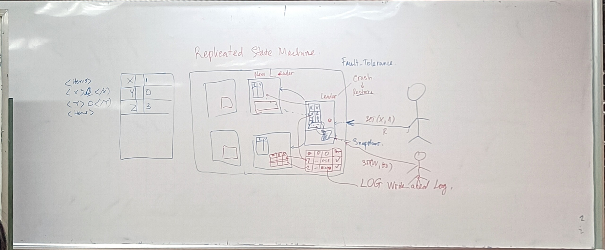

# Distributed Systems

This is the repo of Distributed Systems course

## Lecture 01
[How to Write Go Code](https://go.dev/doc/code#:~:text=Go%20programs%20are%20organized%20into,files%20within%20the%20same%20package.)

## Lab01

## Lecture 02

## Lab02
[rpc](https://pkg.go.dev/net/rpc)
[lab02 submit link](https://docs.google.com/forms/d/e/1FAIpQLSfCGAMuYYLqXx6jTMc3Fmx5dyTD5aJIQPshe8XjIMaf3YvZlw/viewform)
## Lecture 03

## Lab03

## Lecture 04

Các server phân biệt với nhau bằng IP (và port)

Trong key-value store, thêm phần replication vào. Mỗi lần user set giá trị vào bảng key-value khi put dữ liệu lên, ta cần copy dữ liệu qua các server còn lại (giả sử là 5 server)

Các test cases:
- TC_01: Put/get
- TC_02: Put/get when primary is dead
- TC_03: put and get in slow network 

hàm ping để kiểm tra primary server còn sống

tất cả các server tự gửi cho nhau bằng hàm check để lấy một cặp ip-version, chờ vài chục giây -> chọn version cao nhất và ip thấp nhất làm primary mới nếu primảy hiện tại chớt

các máy phải lưu primary_ip, có biến isPrimary

Deadline: 16h00 18/08/2023

Link: https://docs.google.com/forms/d/e/1FAIpQLSdc2hOqxAeM4oY5JvTxe8kG6YGj67zF27OcAZXZI236IFFkew/viewform

## 220823
## Fault Tolerance

Chọn ông leader

- nếu leader chớt (crash) thì dữ liệu của nó đi đâu về đâu? -> dữ liệu store trên ram sẽ mất hoàn toàn -> chọn new leader

- nếu đã chớt mà sống lại (restore) -> liên hệ new leader để copy dữ liệu sang -> không khả thi trong thực tế vì mấy ngàn server, dữ liệu rất lớn -> lưu dữ liệu về local định kỳ (snapshot) (không lưu ram như ở trên) -> thiếu nhiêu thì mới bắt đầu hỏi new leader để copy qua

các cách một dev lưu hashtable vào file/database:
- value<khoảng trắng>key
- cứ x-byte đọc thành 1 giá trị
- lưu dạng xml
- lưu dạng json

làm sao để biết file của leader vừa chớt và new leader khác nhau chỗ nào =))
- lưu hành động của client bằng một cái file (write_head_log file)

| thứ tự | operation | operation | process|
|--------|-----------|-----------|--------|
|   1    |    _      |  x=1      |  v     |
|   2    |    -      |  w=2      |  x     |

Các server đều có một file log, khi có vấn đề xảy ra, ta chỉ cần copy các dòng thiếu của các file log với nhau

Replicated State Machine

